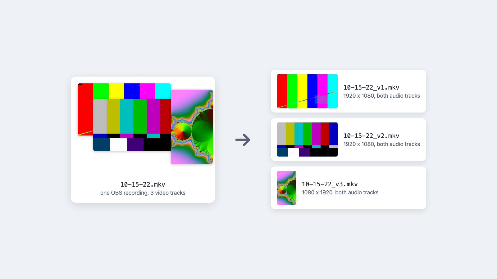

#  unmultitrack

Split a multi-track OBS recording into one normal video file per track

Windows

<!-- media: hero -->

<!-- /media: hero -->

## What it is

If you record with OBS and the Aitum multi-track plugin you end up with one file holding several video streams. This pulls each one out into its own normal video file so editors like Premiere or Resolve are happy with it.

By default every audio track gets copied into each output, which is usually what I want when I bring them into an editor.

The streams are copied without re-encoding, so there's no quality loss from the extraction.

## Get it

Paste this into your AI coding agent (Claude Code, Codex, Cursor...):

> Clone https://github.com/mikecann/unmultitrack and make it my own. It's one of Mike
> Cann's personal tools, so read the README first, change anything specific to his
> setup to suit mine, then help me get it running.

### Or set it up by hand

You'll need Git, Python 3.10 or newer available as `python` on PATH, and `ffmpeg.exe` in `C:\dev\tools` or `ffmpeg` on PATH. `ffprobe.exe` in the same folder or on PATH is optional but recommended. No Python packages, API keys or `.env` file are needed.

In PowerShell:

```powershell
git clone https://github.com/mikecann/unmultitrack.git
cd unmultitrack
powershell -ExecutionPolicy Bypass -File .\install.ps1
```

The installer writes command launchers into `C:\dev\tools`, offers to add that folder to your user PATH, converts the icons and adds the Explorer menu entry for video files. It checks dependencies without downloading ffmpeg. Open a new terminal after a PATH change. Keep the clone where it is, the launchers point to it.

Use `-SkipDeps` to skip dependency checks, or `-ToolsDir "C:\my-tools"` to choose another launcher folder. Binary lookup checks `EXEDIR`, then `C:\dev\tools`, then PATH.

## Using it

```powershell
unmultitrack "C:\videos\recording.mp4"
```

Or right-click a video in Explorer and choose **Mike's Tools > Un-multi-track Video**. On Windows 11, this may be under **Show more options**.

For `recording.mp4`, output goes into:

```text
recording_unmultitracked\
  recording_v1.mp4
  recording_v2.mp4
```

Existing files are not overwritten. If `recording_v1.mp4` already exists, the next output becomes `recording_v1_2.mp4`. Each file keeps the input container extension and receives all audio streams by default.

You can also run directly from the clone:

```powershell
python .\unmultitrack.py "C:\videos\recording.mp4"
```

### Options

```powershell
unmultitrack recording.mp4 --video-only
unmultitrack recording.mp4 --overwrite
unmultitrack recording.mp4 --dry-run
unmultitrack recording.mp4 --output-dir "C:\videos\extracted"
unmultitrack single-track.mp4 --allow-single
```

`--video-only` skips audio. `--overwrite` replaces existing outputs. `--dry-run` prints the ffmpeg commands without creating files. `--output-dir` chooses where the files go.

`--allow-single` copies a file with only one video stream. The default is to stop, because that usually means you right-clicked the wrong file.

### Troubleshooting

If `ffprobe` is missing, the tool falls back to parsing `ffmpeg -i` stream output. If ffmpeg is missing, put it in `C:\dev\tools` or add it to PATH. Run `.\deps.ps1` to check dependencies again.

If the `python` command opens the Microsoft Store or fails, install Python and make sure the installed interpreter is on PATH.

### Uninstalling

```powershell
powershell -ExecutionPolicy Bypass -File .\uninstall.ps1
```

If you installed with a custom `-ToolsDir`, pass the same folder here. This removes the unmultitrack launchers, its Explorer verbs and its generated icon. Your recordings, clone, ffmpeg binaries, shared submenu, shared icon and PATH entry are kept.

## Development

```powershell
python -m unittest discover -s tests -v
pwsh -NoProfile -File tests/test-install.ps1
```

The Python tests and installer helper checks also run on macOS. The helper checks simulate registry operations. Installation, batch launchers and the real Explorer menu still need Windows verification.

## Assets

`docs/header.webp` is the existing generated raster banner. `icons/film.png` and `icons/wrench.png` are from the [famfamfam Silk icon set](https://www.famfamfam.com/lab/icons/silk/) by Mark James, licensed under [CC BY 2.5](https://creativecommons.org/licenses/by/2.5/).

## More tools

You can find my other tools at [mikerosoft.app](https://mikerosoft.app).

MIT licensed.
